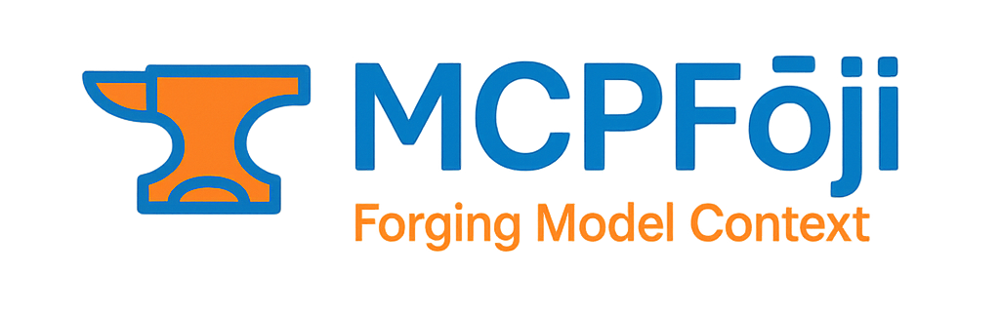
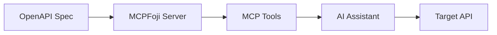

<p align="center">
  
</p>

<p align="center">
  <em>An MCP server that dynamically generates tools from Swagger/OpenAPI specifications</em>
</p>

<br>

<div align="center">

[](https://github.com/cbabil/MCPFoji/releases)
[](https://github.com/cbabil/MCPFoji/blob/main/LICENSE)
[](https://github.com/cbabil/MCPFoji/issues)
[](https://github.com/cbabil/MCPFoji/stargazers)

[](https://python.org)
[](https://modelcontextprotocol.io/)
[](https://spec.openapis.org/oas/latest.html)

</div>

<br>

<p align="center">
  <a href="https://github.com/cbabil/MCPFoji/wiki">📖 Documentation</a> |
  <a href="https://github.com/cbabil/MCPFoji/issues">🐛 Issues</a> |
  <a href="https://github.com/cbabil/MCPFoji/discussions">💬 Discussions</a> |
  <a href="https://github.com/cbabil/MCPFoji/releases">🚀 Releases</a>
</p>

---

## 🌟 Overview

**MCPFoji** is a production-ready Model Context Protocol (MCP) server that automatically generates tools from OpenAPI/Swagger specifications. It bridges the gap between API documentation and usable MCP tools, enabling AI assistants to seamlessly interact with any API that provides proper OpenAPI documentation.

### Key Benefits

- **Zero Configuration**: Works out-of-the-box with any valid OpenAPI specification
- **Enterprise Ready**: Supports multiple transport protocols for different deployment scenarios
- **Developer Friendly**: Simple command-line interface with comprehensive documentation
- **Extensible**: Built on industry-standard protocols and frameworks

## ✨ Features

- 🔄 **Dynamic Tool Generation**: Automatically creates MCP tools from OpenAPI specs
- 🌐 **Multiple Transports**: Supports stdio, HTTP, and Server-Sent Events (SSE)
- 📁 **External References**: Resolves external YAML references in OpenAPI specs
- 🔧 **Configurable**: Flexible configuration options for different deployment scenarios
- 🚀 **MCP Powered**: Built on the efficient MCP framework

## ⚡ Quick Start

### System Requirements

- **Python**: 3.8 or higher
- **Package Manager**: pip or poetry
- **Network**: Internet access for fetching OpenAPI specifications

### Installation

```bash
# Clone the repository
git clone https://github.com/cbabil/MCPFoji.git
cd MCPFoji

# Install dependencies
pip install -r requirements.txt

# Start the server
python src/main.py --spec-url https://your-api.com/openapi.json
```

> **💡 Tip**: Replace `https://your-api.com/openapi.json` with your actual OpenAPI specification URL.

## 📖 Usage

### Basic Commands

```bash
# Default stdio transport
python src/main.py --spec-url https://api.example.com/openapi.json

# HTTP transport for web integration
python src/main.py --spec-url https://api.example.com/openapi.json --transport http --port 8000

# Server-Sent Events for real-time applications
python src/main.py --spec-url https://api.example.com/openapi.json --transport sse --host 0.0.0.0 --port 8080
```

### Configuration Options

| Parameter | Default | Description |
|-----------|---------|-------------|
| `--spec-url` | *Required* | URL of the OpenAPI/Swagger specification |
| `--transport` | `stdio` | Transport protocol: `stdio`, `http`, or `sse` |
| `--host` | `127.0.0.1` | Bind address for HTTP/SSE transports |
| `--port` | `8000` | Port number for HTTP/SSE transports |
| `--base-url` | `http://localhost:9990` | Base URL of the target API |

### Production Examples

<details>
<summary><strong>🏢 Enterprise Setup</strong></summary>

```bash
python src/main.py \
  --spec-url https://api.company.com/v1/openapi.json \
  --transport http \
  --host 0.0.0.0 \
  --port 3000 \
  --base-url https://api.company.com/v1
```
</details>

<details>
<summary><strong>🔧 Development Setup</strong></summary>

```bash
python src/main.py \
  --spec-url http://localhost:8080/docs/openapi.json \
  --base-url http://localhost:8080
```
</details>

## 🏗️ Architecture

MCPFoji follows a clean, modular architecture designed for reliability and extensibility:



### Processing Flow

1. **Specification Loading**: Fetches and validates OpenAPI specifications from remote URLs
2. **Reference Resolution**: Automatically resolves external YAML/JSON references  
3. **Tool Generation**: Converts API endpoints into typed MCP tools with proper schemas
4. **Server Initialization**: Starts the MCP server with the configured transport protocol
5. **Request Handling**: Routes MCP tool calls to the appropriate API endpoints

## 🔧 Advanced Configuration

For production deployments and advanced use cases, MCPFoji offers extensive configuration options. Detailed configuration guides are available in our [documentation](https://github.com/cbabil/MCPFoji/wiki).

### Environment Variables

```bash
export MCPFOJI_LOG_LEVEL=INFO
export MCPFOJI_TIMEOUT=30
export MCPFOJI_RETRIES=3
```

## 📁 Project Structure

```
MCPFoji/
├── src/
│   ├── main.py           # Main application entry point
│   └── lib/
│       ├── args.py       # Command-line argument parsing
│       ├── logger.py     # Logging configuration
│       └── __init__.py
├── assets/
│   └── mcpfoji.png       # Project logo
├── requirements.txt      # Python dependencies
├── README.md             # This file
├── LICENSE               # License information
└── Makefile              # Build automation
```

## 🤝 Contributing

We welcome contributions from the community! MCPFoji is open source and thrives on collaborative development.

### Contributing Guidelines

1. **Fork** the repository and create your feature branch
2. **Write** comprehensive tests for new functionality  
3. **Follow** the existing code style and conventions
4. **Document** your changes in the appropriate files
5. **Submit** a pull request with a clear description

For detailed contribution guidelines, please see our [Contributing Guide](https://github.com/cbabil/MCPFoji/wiki/Contributing).

### Development Environment

```bash
# Setup development environment
git clone https://github.com/cbabil/MCPFoji.git
cd MCPFoji
python -m venv venv
source venv/bin/activate  # On Windows: venv\Scripts\activate
pip install -r requirements.txt

# Run tests (when available)
python -m pytest

# Run linting
python -m flake8 src/
```

## 📝 License

This project is licensed under the terms specified in the [LICENSE](LICENSE) file.

## 🔗 Related Projects

- [FastMCP](https://github.com/jlowin/fastmcp) - The underlying MCP framework
- [Model Context Protocol](https://modelcontextprotocol.io/) - Official MCP documentation

## 🆘 Support & Community

<div align="center">

| Resource | Description |
|----------|-------------|
| 📖 [**Documentation**](https://github.com/cbabil/MCPFoji/wiki) | Comprehensive guides and API references |
| 🐛 [**Issue Tracker**](https://github.com/cbabil/MCPFoji/issues) | Bug reports and feature requests |
| 💬 [**Discussions**](https://github.com/cbabil/MCPFoji/discussions) | Community Q&A and general discussion |
| 📧 [**Maintainer**](https://github.com/cbabil) | Direct contact with the project maintainer |

</div>

### Getting Help

- **Check the [Wiki](https://github.com/cbabil/MCPFoji/wiki)** for detailed documentation
- **Search [existing issues](https://github.com/cbabil/MCPFoji/issues)** before creating new ones
- **Use [Discussions](https://github.com/cbabil/MCPFoji/discussions)** for questions and community support

## 🙏 Acknowledgments

MCPFoji is built on the shoulders of giants. We extend our gratitude to:

- **[FastMCP Team](https://github.com/jlowin/fastmcp)** for providing the robust MCP framework
- **[OpenAPI Initiative](https://www.openapis.org/)** for maintaining the OpenAPI specification
- **[Model Context Protocol](https://modelcontextprotocol.io/)** community for advancing AI-tool integration
- **Open Source Contributors** who make projects like this possible

---

<div align="center">

**[⭐ Star this project](https://github.com/cbabil/MCPFoji/stargazers)** • **[🍴 Fork it](https://github.com/cbabil/MCPFoji/fork)** • **[📖 Read the docs](https://github.com/cbabil/MCPFoji/wiki)**

</div>